# DKD：Jittor与Torch对齐实验
## 环境配置
### 关于jittor安装
**在windows subsystem for linux中安装jittor。**
对于其他jittor安装方法，博主已经踩了不少坑：在windows中，jittor对编译器版本兼容性较差，编译失败。。。遂止；使用docker安装，不需要担心版本兼容性问题了，但是docker中的jittor版本还是4年前的1.2版本，其模块接口与官网文档不匹配，只能翻github的仓库对着源码写，而且这古早版本缺的算子太多了，要自己补很多，工程量太大。。。遂止；
使用wsl也并不是很省心。虽然wsl可以检测到gpu，但jittor没有检测到gpu,可能是cuda版本兼容性问题，博主不想再花精力安装了。。。好在cpu测试通过了，因此本项目的实验都是基于cpu进行的。
下面是jittor安装的版本与代码：

**Jittor(1.3.9.14)**

**g++(11.4.0)**

**cuda_driver_version: [12, 9]**
```shell
#wsl 下 jittor环境搭建
# 创建虚拟环境 jt python=3.7
# 安装编译器
sudo apt install g++ build-essential libomp-dev
# 激活虚拟环境
python3.7 -m venv jt
source jt/bin/activate
# 安装jittor
python3.7 -m pip install jittor
python3.7 -m jittor.test.test_example
```
### 实验环境
||   Torch   | Jittor |
|:----:| :----: | :----: |
|版本| 1.12.0+cu116 | 1.3.9.14  |
|CPU| i5-11400H| i5-13490F|


## 项目框架简介
本项目共log、img、data、jittor_、train_ 五个文件夹；

log存放tensorboard记录的日志，使用prompt.txt中的指令即可查看；

img存放readme中的图片；

data为使用的数据集；

jittor_存放jittor框架的数据加载脚本、训练脚本、测试脚本

torch_存放torch框架的数据加载脚本、训练脚本、测试脚本

## 实验log
具体的日志见log文件夹
### 时间对比
教师模型训练，训练集大小为25000，验证集大小为5000；
|Teacher| Torch用时 /s    |  Jittor用时 /s|
|:----:| :----: | :----: |
|数据加载| 2.45 |  0.10 |
|训练|  5793.60   |    5696.30    |
|评估| 520.70|40.40|

学生模型训练，训练集大小为5000，验证集大小为1000；

|KD| Torch用时 /s    |  Jittor用时 /s|
|:----:| :----: | :----: |
|数据加载| 0.18 |  0.01 |
|训练|  463.38   |   220.13   |
|评估| 18.79|3.09|

|DKD| Torch用时 /s    |  Jittor用时 /s|
|:----:| :----: | :----: |
|数据加载| 0.19 |  0.01 |
|训练|  463.75   |    224.48    |
|评估| 18.66|3.05|

在训练阶段，jittor对学生模型训练加速明显，对教师模型训练加速不明显；在数据加载、评估阶段，jittor都有明显加速。


### 准确率对比
|ACC-TOP1|    Torch  | Jittor |
|:----:| :----: | :----: |
|Teacher|  82.63 |  78.62( -4.01)|
|KD|   66.92  |  64.24( -2.68)    |
|DKD|66.59|64.30( -2.29)

蒸馏使用的教师模型准确率都为78%左右。为了加快训练，学生模型以预训练的模型参数（acc为60%）为基础，进行40轮的蒸馏训练。


--- 
### 教师模型
#### loss曲线
:star:浅蓝色为jittor，深灰色为torch

train:
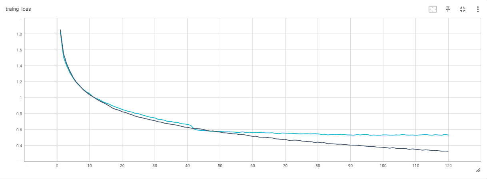
test:
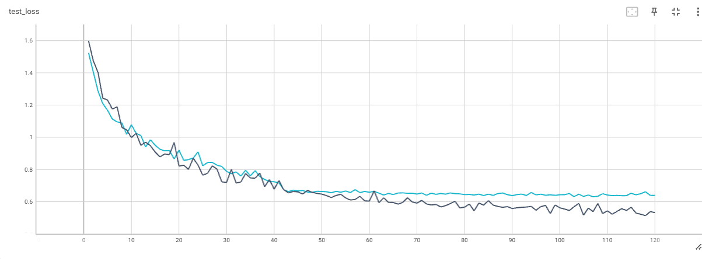
在前50epoch的训练中，jittor的loss曲线与torch的loss曲线几乎重合；在后续的训练中，jittor的loss曲线略微逊于torch，且差距随着轮数的增加而增加。
#### acc-top1曲线
:star: 浅蓝色为jittor，深灰色为torch

train:
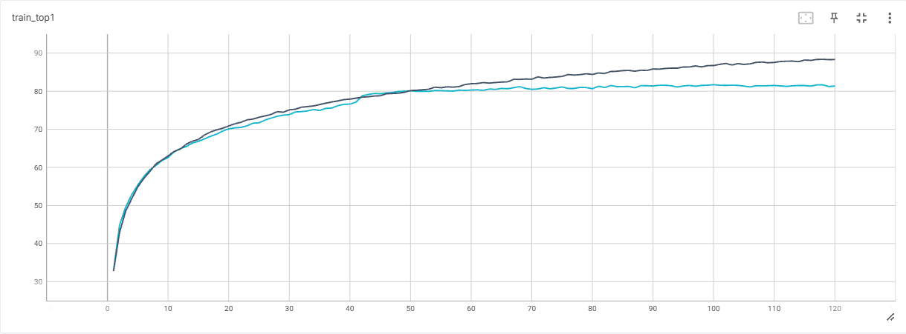
test:
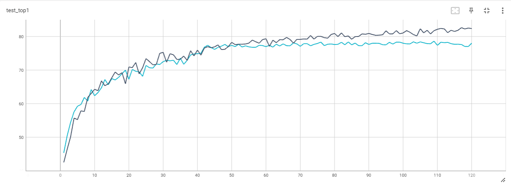
在前50epcoh中，jittor的acc-top1曲线与torch的acc-top1曲线几乎重合；在后续的训练中，jittor的loss曲线略微逊于torch，且差距随着轮数的增加而增加。

### 学生模型
#### loss曲线
:star: 深蓝色为dkd-torch,紫色为kd-torch,绿色为dkd-jittor,红色为kd-jittor

train:
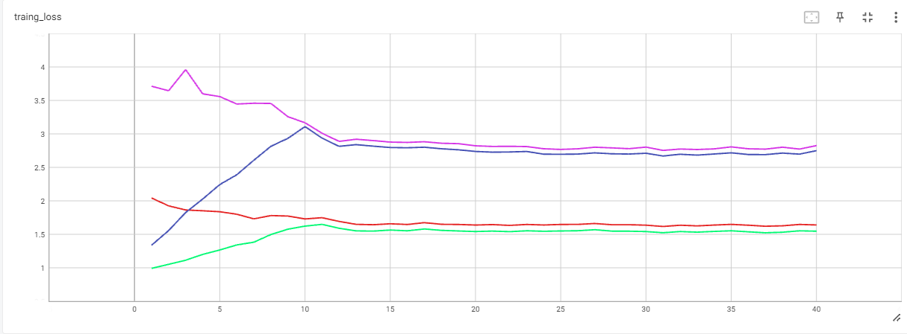
test:
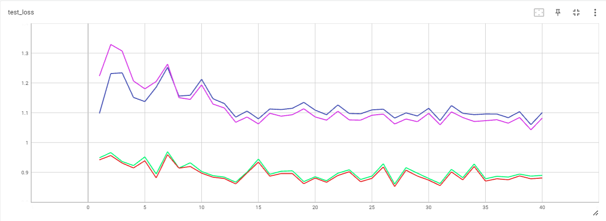
由于dkd增加的loss较大，前10epoch使用warmup线性升温，因此trainloss前10epoch的trainloss会上升

无论是dkd还是kd，jittor的loss都远小于torch的loss，十分不正常，具体分析可见“关于Jittor的Bug--KLDivLoss batchmean输出偏小”。
#### acc-top1曲线
:star: 深蓝色为dkd-torch,紫色为kd-torch,绿色为dkd-jittor,红色为kd-jittor

train:
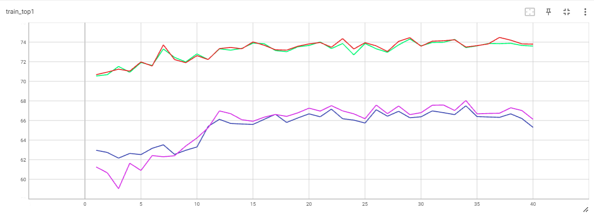
test:
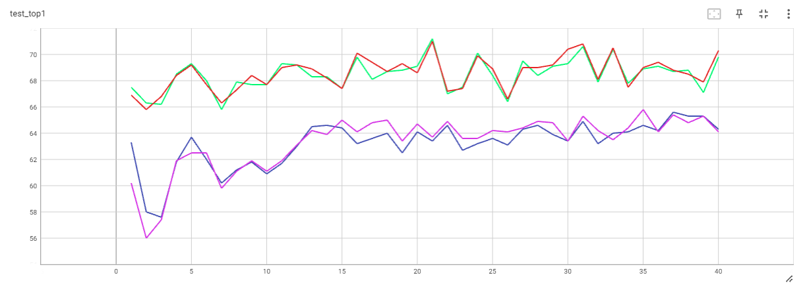

由于jittor的loss远小于torch的loss，jittor模型学习效果逊色于torch。

---

## ❗❗❗关于Jittor的Bug--KLDivLoss batchmean输出偏小
从上述的loss曲线中，不难发现：教师模型（使用CE作为损失函数）jittor和torch的loss曲线之间的误差较小，kd和dkd模型（使用KL+CE作为损失函数）jittor和torch的loss曲线之间的误差较大；通过细究发现，jittor的KL batchmean总是小于torch的KL batchmean,十分异常；在移植的时候，博主曾对包含KL损失函数的KD、DKD进行过对齐实验，并没有出现这种偏小的情况；

直到在target概率分布中输入了0，终于找到问题了，此时KLDivloss输出的是**Nan**
```python
import jittor as jt
kl_loss = jt.nn.KLDivLoss(reduction="batchmean")
teacher = jt.nn.softmax(jt.array([1, 1000, 2],dtype=jt.float32))
student= jt.nn.log_softmax(jt.array([3, 4, 5], dtype=jt.float32))
output = kl_loss(student, teacher)
print("target",teacher) # target jt.Var([0. 1. 0.], dtype=float32)
print(output) # jt.Var([nan], dtype=float32)
```
torch会忽略0，而jittor却是输出Nan,进一步扒batchmean的源码,发现Nan这种异常不会被处理:求和时nan不会被计入,但batch_size依然不变，**导致batchmean被nan稀释**❗
```python
        elif self.reduction == "batchmean":
            loss = loss_pointwise.sum() / input.size(0)
```

## DKD复现
### 模型
由于训练集使用cifar10数据集，再考虑到模型的复杂度，这里使用cifar10模型作为教师模型；学生模型由ciafar10模型简化而来，去掉了一些BN层和激活层。
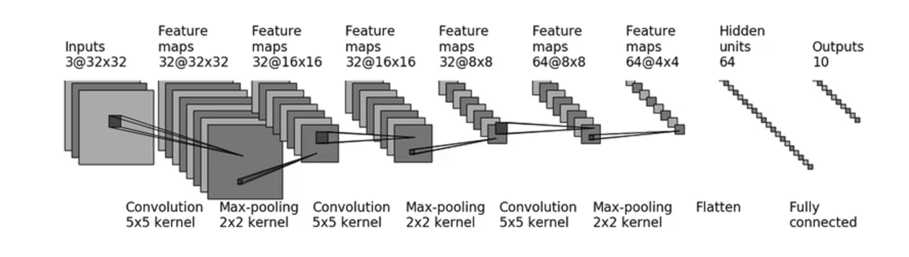
### 损失函数
损失函数 $f=loss_{CE}+loss_{DKD}$
其中，DKD如下：

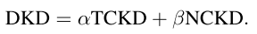

TCKD和NCKD都是KLDivLoss的变种：

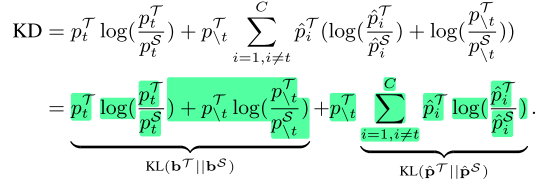

### 超参数β对模型性能的影响
train loss:
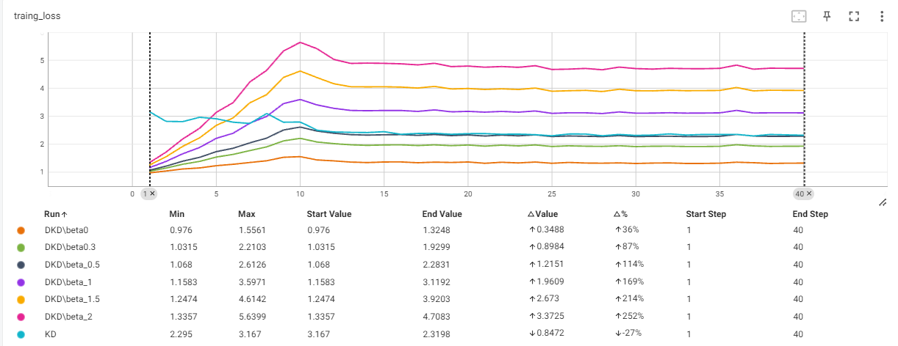
test acc-top1:
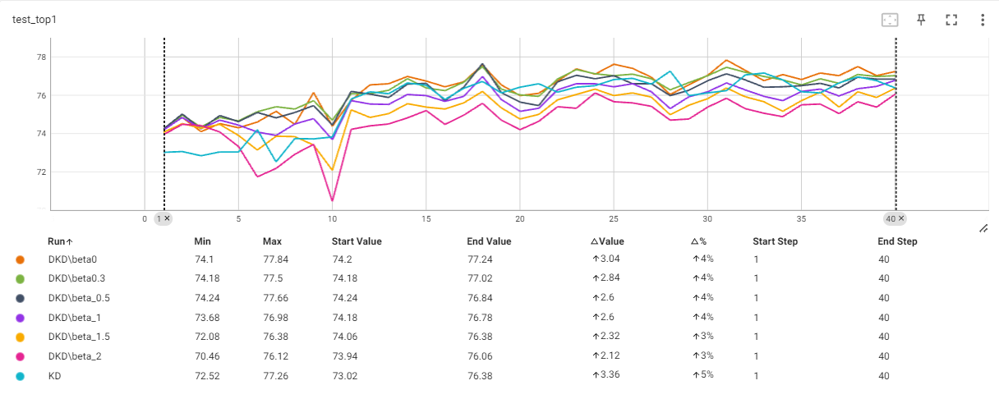

DKD引入超参数α和β对TCKD、NCKD进行解耦，α参考论文，设置为1，对β分别取0、0.3、0.5、1、1.5、2进行实验，发现：当抑制NCKD时，模型性能会得到提升。虽然原文提到NCKD包含dark knowledge，通过增大β能提高模型性能，但在这里，不知受限于何种原因，反而降低了模型性能。当无论增大还是减小β，模型性能的提升都能说明TCKD、NCKD存在抑制关系，**解耦后可以更好的发挥作用**。


### 💡trick心得
#### 关于学习率过大
前15epoch的lr为0.01；16-30epoch的lr为0.001；后10epoch的lr为0.0001
当学习率过大时，loss曲线会出现振荡；减小学习率后，loss曲线会出现一个明显的下降
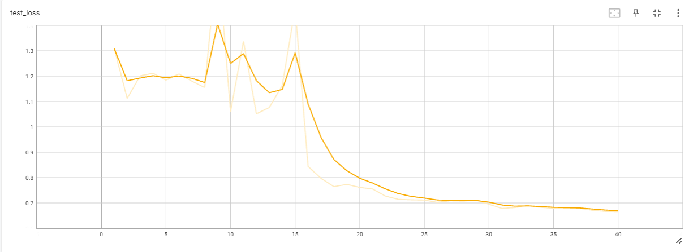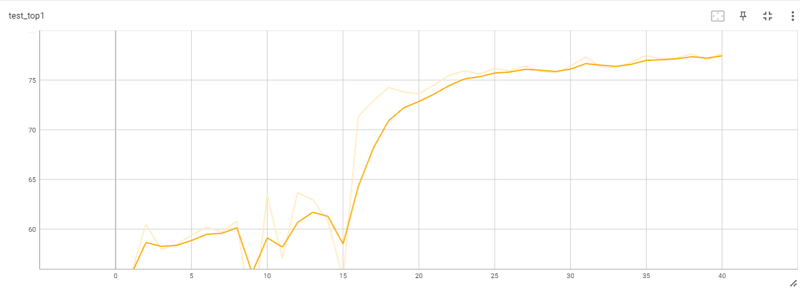
#### 关于小样本数据集训练出现过拟合
由于计算资源有限，训练集只使用10%的数据集进行训练,很容易过拟合；使用数据增强（RandomCrop、HorizontalFlip）后，得到改善
#### 关于损失函数中引入蒸馏后loss增大的问题
蒸馏时的损失函数 $f=loss_{CE}+loss_{KL}$，引入KL散度后导致loss增大，影响模型的学习；
使用warmup来逐渐提高 $loss_{KL}$ 的权重，loss的增加更加平滑，使模型可以地学习；
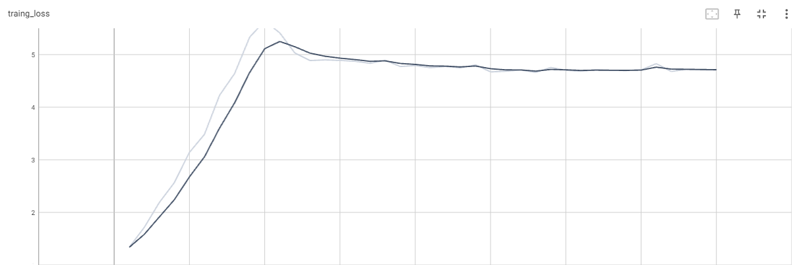
